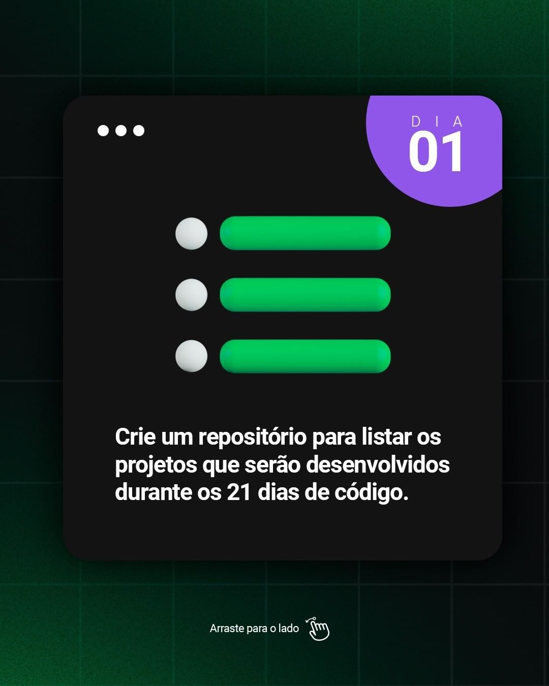

# Desafio 21 dias de Código

Repositório criado para listar os projetos do desafio 21 Dias de Código proposto pela <a href="https://www.instagram.com/rocketseat_oficial/">@rocketseat_oficial .</a> A imagens referentes ao tema do desafio são de origem da <a href="https://www.instagram.com/p/ChTBg1BpLGU/">publicação</a> do desafio e da @rocketseat_opficial

#### DIA 01 - Criação do Repositório

<strong>Descrição: Crie um repositório para listar os projetos que serão desenvolvidos durante os 21 dias de código.</strong>

<a href="https://github.com/brenordev/21_dias_de_codigo"> 🚀 Visualizar Desafio</a>

